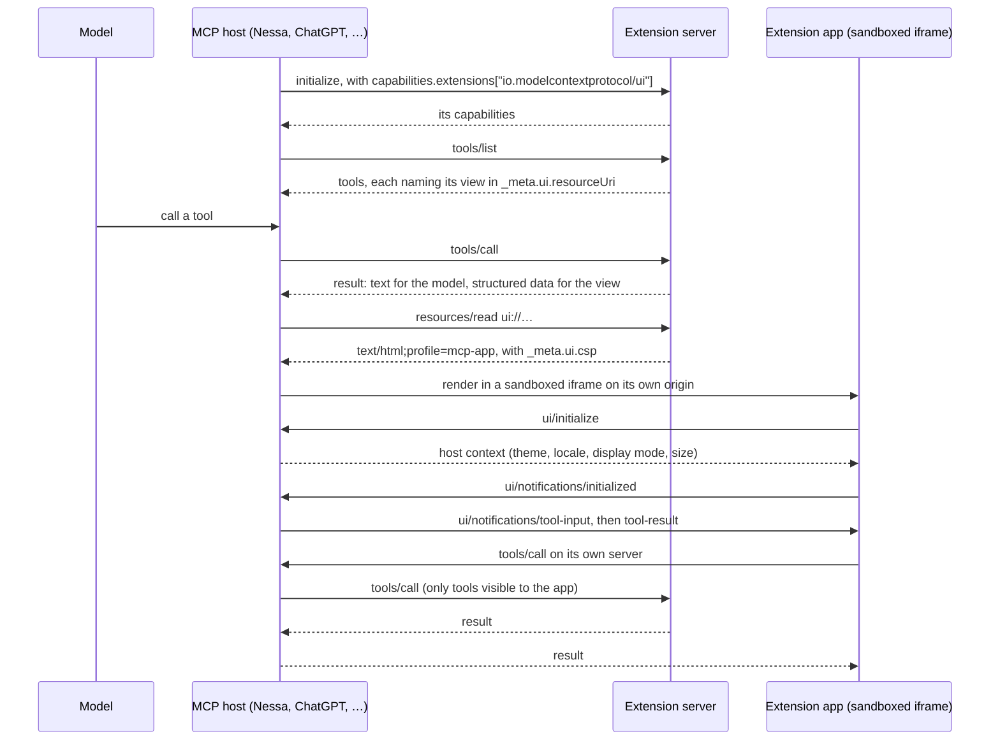

# Nessa extensions

Nessa's first-party extensions. Each one is an MCP server that ships its own
interactive UI as an [MCP App](https://github.com/modelcontextprotocol/ext-apps)
(`io.modelcontextprotocol/ui`), so it works in
[Nessa](https://github.com/nessalabs/nessa-agent) and in any other host that
supports MCP Apps — and, as plain tools with text results, in any MCP host at
all.

Why they live here rather than in the app, and how the repository is laid out,
is in the [decision record](docs/adr/todo/1-extensions-repo.md). How to work in
it is in [AGENTS.md](AGENTS.md).

## Extensions

| Package | What it is | Status |
| --- | --- | --- |
| [`@nessalabs/experiments`](extensions/experiments) | An experiment's overview, areas, runs, and run detail, with an inline card in the conversation | The model: #4. Planned: the server (#5), the components (#6), the app (#7) |

## How an extension works



A host without MCP Apps stops after the tool result, and the text in it stands
on its own.

## Using an extension

Every extension is an npm package that runs as a stdio MCP server:

```sh
npx -y @nessalabs/<name>
```

It can also serve streamable HTTP, for hosts that connect to a remote server;
the option that selects it is set by
[#3](https://github.com/nessalabs/nessa-extensions/issues/3).

**Nessa.** Nessa starts an MCP server from an absolute command with an empty
environment, so `npx`, which needs `node` on `PATH`, does not start there.
Install the package, then give Nessa `node` and the package's server script,
as [the gateway guide](https://github.com/nessalabs/nessa-agent/blob/main/docs/guides/gateway-chat.md#local-setup)
describes for `agents.mcpServers` in the gateway's `config.json`:

```sh
npm install --prefix /absolute/path/to/extensions @nessalabs/<name>
```

```json
{
  "name": "<name>",
  "command": "/absolute/path/to/node",
  "args": ["/absolute/path/to/extensions/node_modules/@nessalabs/<name>/<bin>"]
}
```

where `<bin>` is the file the package's `bin` names. Its tools reach the agent
there today, as any configured server's do, with their text results. Its view
needs Nessa to host MCP Apps, which is
[nessalabs/nessa-agent#345](https://github.com/nessalabs/nessa-agent/issues/345).

**ChatGPT.** ChatGPT does not start local processes. Serve the extension over
streamable HTTP at a public HTTPS URL (typically ending in `/mcp`), or reach
the stdio server through OpenAI's Secure MCP Tunnel. Turn on developer mode
(Settings → Security and login), then add the server under ChatGPT Plugins, as
[OpenAI's guide](https://developers.openai.com/apps-sdk/deploy/connect-chatgpt)
describes.

**Other hosts** that take a stdio server — Claude Desktop, Claude Code, VS Code,
Goose, and others — use the usual `mcpServers` entry:

```json
{
  "mcpServers": {
    "<name>": { "command": "npx", "args": ["-y", "@nessalabs/<name>"] }
  }
}
```

or, in Claude Code, `claude mcp add <name> -- npx -y @nessalabs/<name>`. A
host that supports MCP Apps shows the view; any other shows the text results.

## Publishing

Each extension under [`extensions/`](extensions) is published to npm as
`@nessalabs/<name>`. Its package holds the server, the app built into one
self-contained HTML file that the server serves as its `ui://` resource, and a
`bin` that `npx` runs. The shared packages under [`packages/`](packages) are
bundled into it and are not published on their own.

Nothing is published yet, and nothing publishes from a pull request. The
release workflow arrives with the first extension; until then every package is
`private`.

## Development

Requires Node 24 or later and pnpm 11.9.0.

```sh
pnpm install
```

CI ([`.github/workflows/ci.yml`](.github/workflows/ci.yml)) runs these on every
pull request and on `main`; run the ones your change touches before pushing.

| Command | What it checks |
| --- | --- |
| `pnpm format:check` | Prettier |
| `pnpm lint` | ESLint, with typescript-eslint |
| `pnpm typecheck` | TypeScript, strict, each package and extension on its own: every file in its folder, `rootDir` its folder, and every file it resolves within what it may use ([`scripts/boundary/typecheck.mjs`](scripts/boundary/typecheck.mjs)) |
| `pnpm build` | Builds each extension with Vite, in a copy of the repository holding only what it may use, and refuses any build with a module from elsewhere ([`scripts/boundary/build.mjs`](scripts/boundary/build.mjs)) |
| `pnpm test` | Vitest, one project per package and extension, each refused a module Vite loads from outside what it may use ([`scripts/boundary/vitest.mjs`](scripts/boundary/vitest.mjs)); then the guards' own tests |
| `pnpm architecture` | The pinned install layout and the dependencies in it ([`scripts/check-architecture.mjs`](scripts/check-architecture.mjs)), after its own tests. Bare Node: CI runs it before installing anything |

```
packages/
  common/        logic more than one extension needs
  app-shell/     the browser side of an app (#2)
  server-kit/    the server side of an extension (#3)
extensions/      one directory per extension; see its README
scripts/         the architecture check and the boundary guards
docs/adr/        decision records
```

`nessa_ui`, Nessa's design system — its primitives, shared components, and
reused UI composites — is taken from npm as `@nessalabs/ui`, by version, from
[#2](https://github.com/nessalabs/nessa-extensions/issues/2), the first package
to import it. Publishing it there is nessa_ui's work, not this repository's.

## License

[MIT](LICENSE)
